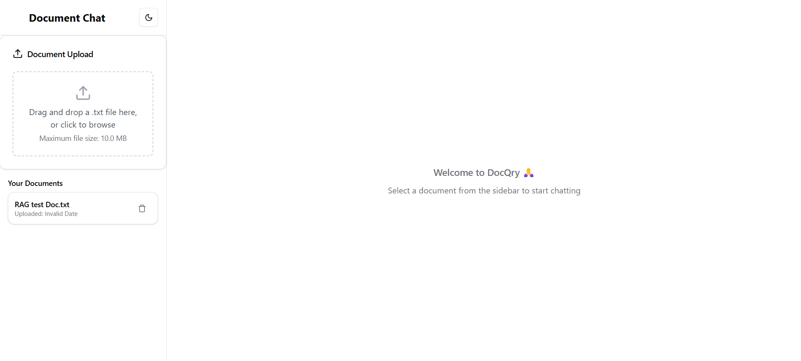
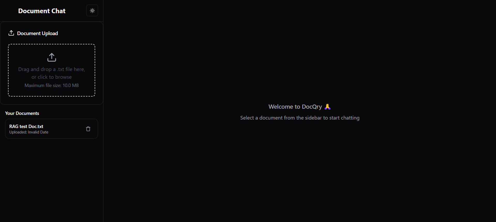
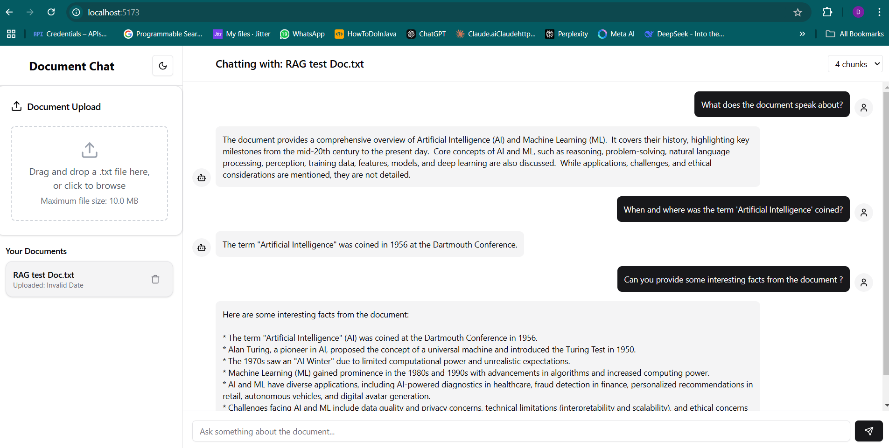
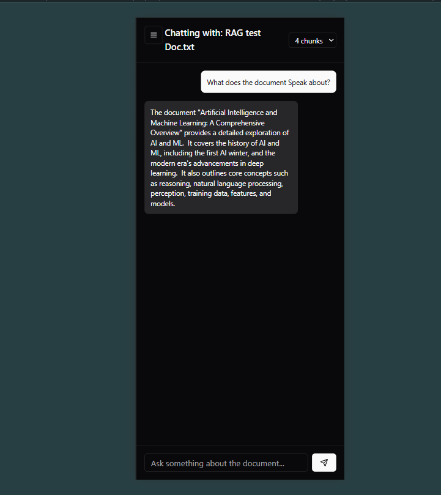

# DocQry (Document-Query-App)

## Description
DocQry is a web-based application that lets you interact with your documents using Natural Language. Powered by **RAG (Retrieval-Augmented Generation)** capabilities, it efficiently retrieves, summarizes, and responds to queries based on the context of your documents. Whether you need quick insights or detailed information, DocQry bridges the gap between static documents and dynamic interaction.

## Demo
### Video Demo
[](./readme_assets/DocQry_Demo.mp4)

## Application Architecture


## Features
- Responsive, intuitive, and user-friendly UI (with drag-and-drop support).
- Conversational querying with document context.
- Context and prompt management for improved response relevance.
- Support for `.txt` files in the current version (and easily extendable to support other formats).
- Powered by advanced AI models for context generation and summarization.

## Tech Stack
The application was built using the following technologies:
- **Backend:** Spring Boot (REST APIs), FastAPI (vector embeddings, context summarization)
- **Frontend:** *(ReactJS + VITE + Tailwind CSS)*
- **Databases:** PostgreSQL (document metadata), Qdrant (vector embeddings)
- **AI Models:** 
  - Google's LLM `(model: Gemini 1.5 flash)` for final response generation  
  - Hugging Face BAAI Bert `(model: BAAI/bge-large-en-v1.5)` for generating vector embeddings  
  - Mistralai `(model: mistral-medium)` for context summarization
- **Containerization:** Docker Desktop

## Requirements
To build and run this application, ensure you have:
- Java 21 installed.
- Python 3.9+ installed (for FastAPI).
- PostgreSQL.
- Qdrant.
- Docker (for containerization).

**[You can use the Docker images for PostgreSQL & Qdrant]**

## Setup Instructions
### 1. Clone the Repository
```bash
git clone https://github.com/dilip0418/document-query-app.git
cd document-query-app
```

### 2. Backend Setup
- Navigate to the Spring Boot directory:
  ```bash
  cd backend
  ```
- Configure the database connection in `application.properties`. (Optional if you want to use databases locally `[PostgreSQL and Qdrant]`).
- Start the backend:
  ```bash
  ./mvnw spring-boot:run
  ```
  **Or simply use the Editor/IDE UI to run the application.**

### 3. FastAPI Setup
- Navigate to the FastAPI directory:
  ```bash
  cd embedding-service
  ```
- Install dependencies:
  ```bash
  pip install -r requirements.txt
  ```
- Run the server:
  ```bash
  uvicorn app.main:app --reload
  ```

### 4. Using Docker-Compose
Alternatively, if you prefer to use the `docker-compose` method, follow these steps:
- Create `.env` files in each project folder (`frontend`, `backend`, and `embedding-service`).
- Sample `.env` files:

**Frontend (`frontend/.env`)**
```bash
VITE_BACKEND_BASE_URL=http://localhost:8080/api
```

**Backend (`backend/.env`)**
```bash
# Database configuration
DB_URL=jdbc:postgresql://postgres:5432/DocQry
DB_USER=<db-user>
DB_PWD=<db-password>

# Vector Database configuration
VEC_DB_URL=http://qdrant:6333
VEC_DB_COLLECTION=documents

# FastAPI configuration
FAST_API_BASE_URL=http://embedding-service:8000

# AI Service API Configuration
GEMINI_API_KEY=<GEMINI-API-KEY>
GEMINI_API_URL=https://generativelanguage.googleapis.com/v1/models/<model-name>:generateContent
```

**FastAPI (`embedding-service/.env`)**
```bash
# Mistral AI API Key
MISTRAL_API_KEY=<MISTRALAI-API-KEY>
```

- Build and run the containers:
  ```bash
  docker-compose build
  docker-compose up -d
  ```

## How It Works
1. **Upload a Document:** Users can upload a document to start a chat or select from previously uploaded documents.
2. **Processing:** The application parses the document, tokenizes the text, and stores the vector embeddings in the Qdrant database. Metadata is stored in PostgreSQL.
3. **Context Initialization:** When a document is selected, the application creates an initial context summarizing the first six chunks.
4. **Querying:** Users input queries via the UI. Relevant chunks are retrieved from Qdrant and PostgreSQL, and a context is prepared.
5. **Response Generation:** The user query and context are fed to the LLM (Gemini) for a response. Context is managed using a `Deque` to ensure efficiency and avoid max-token limit errors.

## Screenshots
  
*DocQry Light Mode*

  
*DocQry Dark Mode*

  
*DocQry Desktop UI*

  
*DocQry Mobile UI*

## Future Scope
- Extend support to `.pdf`, `.doc`, `.docx`, and other file formats.
- Transform the application to support multiple users with secure authentication.
- Introduce chat history storage, enabling users to resume previous sessions.
- Explore multi-modality using vision models to extract tables, images, and complex document elements.

## Contributing
I warmly welcome collaborations! Whether you're interested in improving the app, suggesting features, or reporting issues, I'd love to have your input. Feel free to get in touch via the following platforms:

[](https://www.linkedin.com/in/dilip-kumar-bk/) 
[](https://dilip-sudheer.netlify.app/) 
[](https://github.com/dilip0418)  


